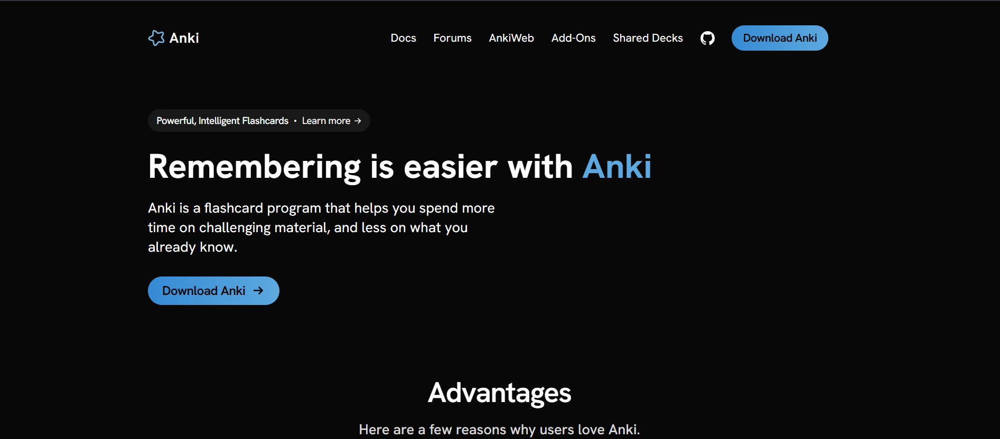
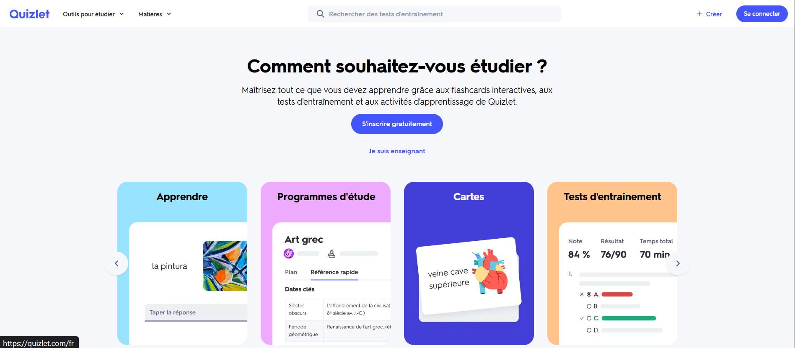
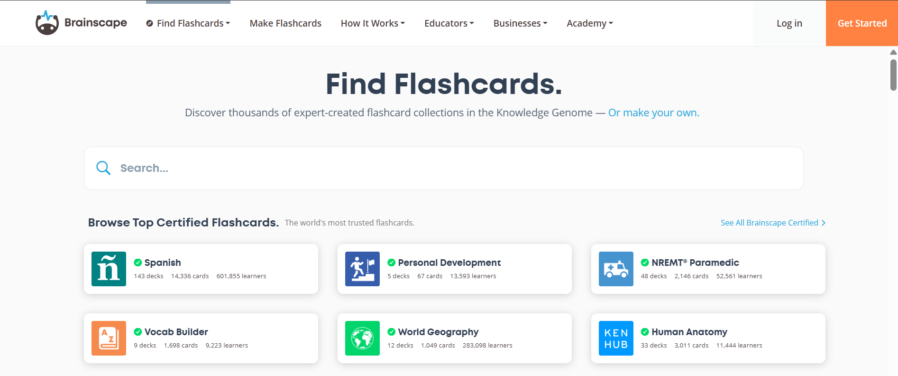

# 🔎 Benchmark : Analyse de sites de flashcards existants

Voici quelques références :

---

## 💻 1. Anki

https://apps.ankiweb.net/

### Points forts :

- Algorithme de répétition espacée (très puissant pour mémoriser)
- Ultra flexible (cartes personnalisées)
- Fonctionne offline (téléchargement disponible)

### Faiblesses :

- UX assez austère
- Prise en main pas intuitive pour débutants
- Trop complexe pour un usage simple (beaucoup de navigation à travers la documentation)

---

## 📚 2. Quizlet

https://quizlet.com/fr

### Points forts :

- Interface très simple et agréable
- Différents modes (flashcards, quiz, test)
- Bon onboarding

### Faiblesses :

- Beaucoup de fonctionnalités payantes (abonnements)
- Parfois trop “chargé” pour juste réviser vite
- Peu orienté développeur

---

## 🧠 3. Brainscape

https://www.brainscape.com/subjects

### Points forts :

- UX épurée
- Progression visible
- Système de confiance (évaluation personnelle)

### Faiblesses :

- Peu adapté à du contenu technique (comme du code)
- Pas toujours gratuit

---

## **Ce que DevFlash peut apporter :**

- 🔰 UI simple + accès rapide aux cartes
- 🎯 Ciblé développeurs débutants (et intermédiaires)
- ⚡ Parcours rapide (5–20 cartes)
- 🎲 Randomisation → moins passif
- 🔗 Lien direct vers documentation pour gagner du temps et approfondir une notion